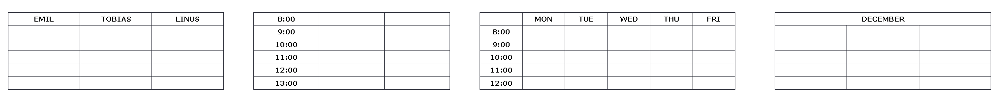

# HTML Table Headers
HTML tables can have headers for each column or row, or for many columns/rows.



## HTML Table Headers
Table headers are defined with `th` elements. Each `th` element represents a table cell.

```html
<table>
    <tr>
        <th>Firstname</th>
        <th>Lastname</th>
        <th>Age</th>
    </tr>
    <tr>
        <td>Sumit</td>
        <td>Kumar</td>
        <td>20</td>
    </tr>
    <tr>
        <td>Amit</td>
        <td>Yadav</td>
        <td>18</td>
    </tr>
</table>
```
## Vertical Table Headers
To use the first column as table headers, define the first cell in each row as a `<th>` element:

```html
<table>
    <tr>
        <th>Firstname</th>
        <td>Sumit</td>
        <td>Amit</td>
    </tr>
    <tr>
        <th>Lastname</th>
        <td>Kumar</td>
        <td>Yadav</td>
    </tr>
    <tr>
        <th>Age</th>
        <td>21</td>
        <td>18</td>
    </tr>
</table>
```

## Align Table Headers
By default, table headers are bold and centered:

To left-align the table headers, use the CSS `text-align` property:

```css
th {
  text-align: left;
}
```

## Header for Multiple Columns
You can have a header that spans over two or more columns.

To do this, use the colspan attribute on the `<th>` element:

```html
<table border>
    <tr>
        <th colspan="2">Name</th>
        <th>Age</th>
    </tr>
    <tr>
        <td>Sumit</td>
        <td>Kumar</td>
        <td>21</td>
    </tr>
    <tr>
        <td>Amit</td>
        <td>Yadav</td>
        <td>18</td>
    </tr>
</table>
```