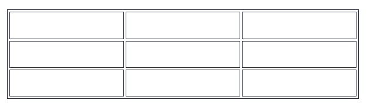
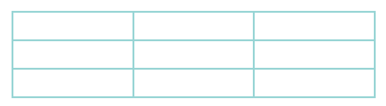

# HTML Table Borders
HTML tables can have borders of different styles and shapes.

## How To Add a Border
To add a border, use the CSS border property on `table`, `th`, and `td` elements:

<style>
table, th, td {
  border: 1px solid black;
}
</style>
</head>
<body>



### Example

```css
table, th, td {
  border: 1px solid black;
}
```

## Collapsed Table Borders
To avoid having double borders like in the example above, set the CSS `border-collapse` property to `collapse`.

This will make the borders collapse into a single border:


### Example
```css
table, th, td {
  border: 1px solid black;
  border-collapse: collapse;
}
```
## Style Table Borders

If you set a background color of each cell, and give the border a white color (the same as the document background), you get the impression of an invisible border:


### Example
```css
table, th, td {
  border: 1px solid white;
  border-collapse: collapse;
}
th, td {
  background-color: #96D4D4;
}
```

## Round Table Borders
With the `border-radius` property, the borders get rounded corners:

	 
 	 	 
Example
```css
table, th, td {
  border: 1px solid black;
  border-radius: 10px;
}
```
Skip the border around the table by leaving out `table` from the css selector:


 	 	 
Example
```css
th, td {
  border: 1px solid black;
  border-radius: 10px;
}
```
## Dotted Table Borders
With the `border-style` property, you can set the appearance of the border.


The following values are allowed:


### Example
```css
th, td {
  border-style: dotted;
}
```
## Border Color

With the `border-color` property, you can set the color of the border.



### Example
```css
th, td {
  border-color: #96D4D4;
}
```
HTML Exercises
Test Yourself With Exercises
Exercise:
Use the correct CSS border values to create a solid black 3 pixels border on a table element.

table, th, td {
  border: 
;
}