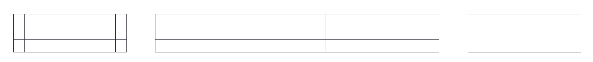
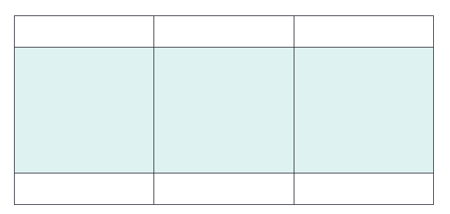

# HTML Table Sizes
HTML tables can have different sizes for each column, row or the entire table.



Use the `style` attribute with the `width` or `height` properties to specify the size of a table, row or column.

## HTML Table Width
To set the width of a table, add the `style` attribute to the `<table>` element:

### Example : [File](table_size.html)
Set the width of the table to 100%:
```html
<table style="width:100%">
  <tr>
    <th>Firstname</th>
    <th>Lastname</th>
    <th>Age</th>
  </tr>
  <tr>
    <td>Sumit</td>
    <td>Kumar</td>
    <td>20</td>
  </tr>
  <tr>
    <td>Amit</td>
    <td>Yadav</td>
    <td>18</td>
  </tr>
</table>
```

> Note: Using a percentage as the size unit for a width means how wide will this element be compared to its parent element, which in this case is the `<body>` element.

## HTML Table Column Width
 	 	 

 	 	 
To set the size of a specific column, add the style attribute on a `<th>` or `<td>` element:

### Example
Set the width of the first column to 70%:
```html
<table style="width:100%">
  <tr>
    <th style="width:70%">Firstname</th>
    <th>Lastname</th>
    <th>Age</th>
  </tr>
  <tr>
    <td>Jill</td>
    <td>Smith</td>
    <td>50</td>
  </tr>
  <tr>
    <td>Eve</td>
    <td>Jackson</td>
    <td>94</td>
  </tr>
</table>
```
## HTML Table Row Height
 	 	 

 	 	 
To set the height of a specific row, add the `style` attribute on a table row element:

Example
Set the height of the second row to 200 pixels:
```html
<table style="width:100%">
  <tr>
    <th>Firstname</th>
    <th>Lastname</th>
    <th>Age</th>
  </tr>
  <tr style="height:200px">
    <td>Jill</td>
    <td>Smith</td>
    <td>50</td>
  </tr>
  <tr>
    <td>Eve</td>
    <td>Jackson</td>
    <td>94</td>
  </tr>
</table>
```

### Exercise:
Use CSS styles to make the table 300 pixels wide.
```html
<table __________>
  <tr>
    <th>First Name</th>
    <th>Last Name</th>
    <th>Points</th>
  </tr>
  <tr>
    <td>Sumit</td>
    <td>Yadav</td>
    <td>50</td>
  </tr>
</table>
```